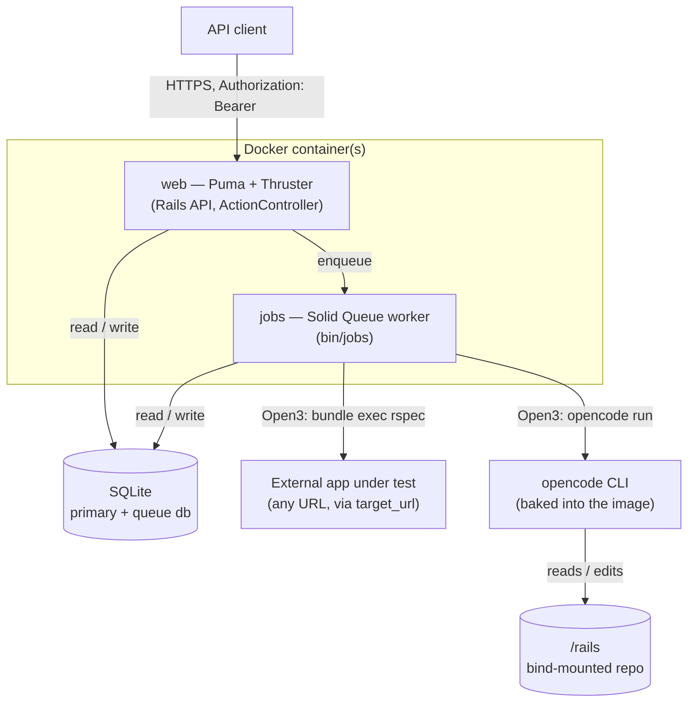
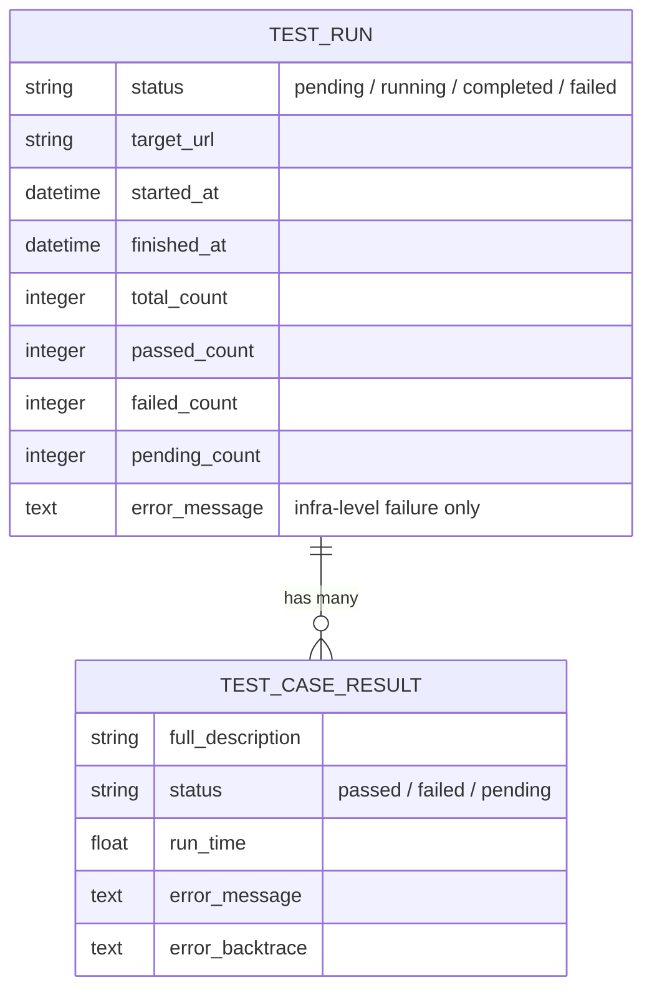
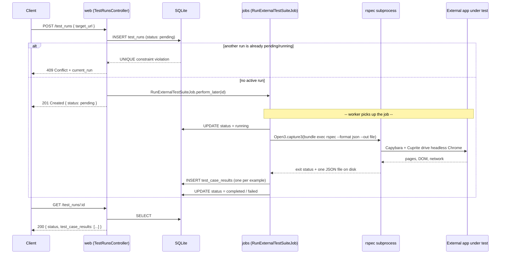
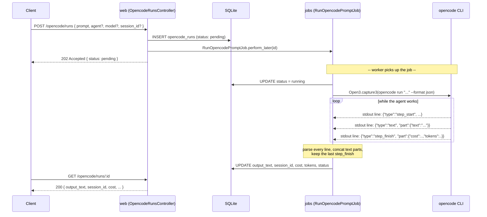
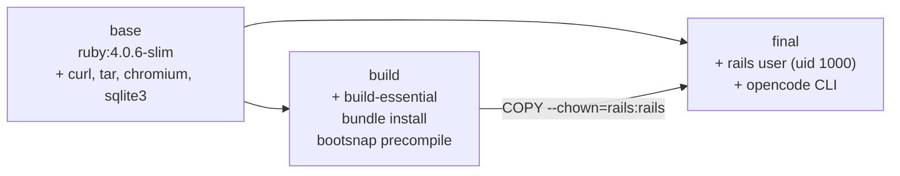
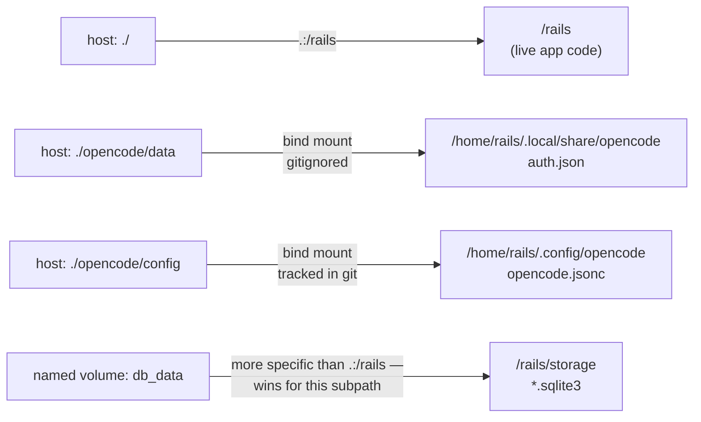

# App Test API — Architecture & Implementation

The README tells you how to run it. This is the drawing set underneath — why
every design decision looks the way it does, where the sharp edges are, and
the two real bugs that shaped the current implementation.

| | |
|---|---|
| **Purpose** | Trigger & report UI tests against an external app |
| **Secondary** | Drive the opencode CLI over HTTP |
| **Runtime** | Rails 8.1.3, API-only |
| **Jobs** | Solid Queue (DB-backed, no Redis) |
| **Storage** | SQLite ×2 (primary, queue) |
| **Auth** | Fixed bearer token, fail-closed |

## Table of contents

1. [Overview](#1--overview)
2. [Domain model](#2--domain-model)
3. [Lifecycle of a test run](#3--lifecycle-of-a-test-run)
4. [Lifecycle of an opencode run](#4--lifecycle-of-an-opencode-run)
5. [The concurrency bug](#5--the-concurrency-bug)
6. [Authentication](#6--authentication)
7. [Two RSpec suites that must never merge](#7--two-rspec-suites-that-must-never-merge)
8. [Docker & the container](#8--docker--the-container)
9. [Security posture](#9--security-posture)
10. [Endpoint reference](#10--endpoint-reference)

---

## 1 · Overview

The application does two unrelated-sounding things through the same pattern.
First, it triggers a browser-automated RSpec suite against some *other*
application and reports pass/fail results over HTTP. Second — added later,
once the container had opencode installed for interactive use — it exposes
that same CLI as an HTTP surface, so a caller can trigger a prompt and read
back what the agent did.

Both features share one shape: a controller creates a row in `pending`
state, hands the real work to a Solid Queue job, and returns immediately.
The job shells out to an external process (`rspec` or `opencode`), captures
its output, and updates the row to `completed` or `failed`. The client
polls. Nothing here talks to a subprocess synchronously from a request
thread.

**FIG. 1 — system boundary**



The two job types never share code, only the pattern. That's deliberate —
see [§7](#7--two-rspec-suites-that-must-never-merge) for why the two RSpec
contexts in this repo are kept strictly apart, and
[§4](#4--lifecycle-of-an-opencode-run) for why the opencode job parses a
completely different output format than the test job does.

## 2 · Domain model

Three tables, two independent families. `TestRun` owns many
`TestCaseResult` rows (one per RSpec example). `OpencodeRun` stands alone —
an opencode invocation doesn't decompose into child records the way a test
suite run does.

**FIG. 2 — test-run schema**



`OpencodeRun` is shaped the same way conceptually but carries
opencode-specific fields instead of a child association — `prompt`,
`agent`, `model`, the `session_id` opencode assigned, the concatenated
`output_text`, and `cost`/token counts pulled out of the run's event stream
(detailed in [§4](#4--lifecycle-of-an-opencode-run)).

```ruby
# app/models/test_run.rb
class TestRun < ApplicationRecord
  has_many :test_case_results, dependent: :destroy

  enum :status, { pending: "pending", running: "running", completed: "completed", failed: "failed" }

  scope :active,   -> { where(status: [:pending, :running]) }
  scope :finished, -> { where(status: [:completed, :failed]) }

  def duration_seconds
    return nil unless started_at && finished_at
    (finished_at - started_at).round(2)
  end
end
```

Both status enums use **strings** in the database, not Rails' default
integer-backed enum. That's a legibility choice: a stray `sqlite3
storage/production.sqlite3 "select status from test_runs"` during an
incident reads `failed`, not `3`.

## 3 · Lifecycle of a test run

`POST /test_runs` creates the row and enqueues the job in the same request;
everything below the dashed line happens on the `jobs` worker, seconds to
minutes later.

**FIG. 3 — POST /test_runs → result**



The job shells out rather than invoking RSpec in-process. That's not a
style preference — `RSpec::Core::Runner` keeps global state (registered
example groups, hooks) that isn't safe to reuse across multiple runs inside
one long-lived process, and the `jobs` worker is exactly that: one process
that will run this job hundreds of times over its life. A subprocess per
run also means a Cuprite/Chrome crash takes down one job, not the worker.

```ruby
# app/jobs/run_external_test_suite_job.rb (excerpt)
env = { "HEADLESS" => "true" }
env["TARGET_URL"] = test_run.target_url if test_run.target_url.present?

_stdout, stderr, process_status = Open3.capture3(
  env,
  "bundle", "exec", "rspec",
  "-O", suite_dir.join(".rspec").to_s,
  "--require", suite_dir.join("spec_helper").to_s,
  "--format", "json", "--out", json_path.to_s,
  suite_dir.join("specs").to_s,
  chdir: Rails.root.to_s
)

if File.exist?(json_path)
  import_results!(test_run, JSON.parse(File.read(json_path)), process_status)
else
  test_run.update!(status: :failed, finished_at: Time.current,
    error_message: "RSpec did not produce output. exit=#{process_status.exitstatus} stderr=#{stderr.to_s.truncate(5000)}")
end
```

Note the `-O` flag pointing at the suite's own `.rspec` file and an
explicit `--require spec_helper` — both by absolute path. That's what lets
this job run cleanly from `Rails.root` without picking up the root
project's own `.rspec`/`rails_helper`, which exist for a completely
different suite ([§7](#7--two-rspec-suites-that-must-never-merge)). RSpec's
`--format json --out` writes one complete JSON document to a file after the
run finishes — contrast that with how opencode streams events, next
section.

## 4 · Lifecycle of an opencode run

Same shape as §3, different subprocess and a genuinely different output
contract. `opencode run --format json` doesn't write one JSON document — it
streams **newline-delimited JSON events** to stdout as the agent works.

**FIG. 4 — POST /opencode/runs → result**



Here's an actual captured event stream for the prompt `"reply with exactly:
pong"`, three lines, unedited:

```
{"type":"step_start","sessionID":"ses_064204b29ffeX6Q9QiEuh7dFp4","part":{"type":"step-start"}}
{"type":"text","sessionID":"ses_064204b29ffeX6Q9QiEuh7dFp4","part":{"type":"text","text":"pong"}}
{"type":"step_finish","sessionID":"ses_064204b29ffeX6Q9QiEuh7dFp4","part":{"type":"step-finish","tokens":{"input":6,"output":17},"cost":0.0043416}}
```

The job's parsing logic is small on purpose — it doesn't try to model every
event type opencode can emit (tool calls, reasoning blocks, errors), only
the three fields the API contract promises:

```ruby
# app/jobs/run_opencode_prompt_job.rb (excerpt)
stdout, stderr, status = OpencodeCli.exec(*args)

events = stdout.each_line.filter_map { |line| JSON.parse(line) rescue nil }
text = events.select { |e| e["type"] == "text" }.map { |e| e.dig("part", "text") }.join
finish = events.reverse.find { |e| e["type"] == "step_finish" }
session_id = events.find { |e| e["sessionID"] }&.dig("sessionID")

run.update!(
  status: status.success? ? :completed : :failed,
  session_id: session_id,
  output_text: text,
  raw_events: stdout,                                  # kept verbatim for debugging
  cost: finish&.dig("part", "cost"),
  input_tokens: finish&.dig("part", "tokens", "input"),
  output_tokens: finish&.dig("part", "tokens", "output"),
  error_message: status.success? ? nil : stderr.presence
)
```

`filter_map { JSON.parse(line) rescue nil }` quietly drops any line that
isn't valid JSON on its own — cheap insurance against a stray log line
reaching stdout and aborting the whole parse. `raw_events` keeps the
untouched stream in the database specifically so a confusing `output_text`
can be cross-checked against what actually happened, without re-running
anything.

```ruby
# app/services/opencode_cli.rb — the shared subprocess wrapper
class OpencodeCli
  def self.exec(*args, env: {})
    Open3.capture3(env, "opencode", *args, chdir: Rails.root.to_s)
  end
end
```

Every opencode-backed endpoint — the async run job and the three
synchronous read endpoints below — goes through this one method. Only
`opencode run` takes `--format json`; `session list`, `session delete`, and
`agent list` have no machine-readable mode, so those controllers don't try
to parse their plain-text/table output at all — they return it verbatim as
`{ "output": "..." }`. Regex-parsing a human-formatted table for marginal
benefit wasn't worth the fragility.

## 5 · The concurrency bug

Only one `TestRun` may be `pending` or `running` at a time — two browser
sessions fighting over the same Chrome instance isn't something to allow.
The obvious tool is a partial unique index. The obvious version of that
index is wrong, and it shipped that way first.

> **Field note — caught during manual verification, not by a test**
>
> A unique index on `status`, scoped to `WHERE status IN
> ('pending','running')`, only rejects two rows sharing the *same* value —
> two `pending` rows. It does nothing to stop one `pending` row and one
> `running` row coexisting, which is exactly the case that matters: the
> first request creates a `pending` row, the worker flips it to `running`,
> and a second request arriving in that window sailed straight through the
> index and created a second active run.

**What each version of the index actually allows**

| Index | Row A | Row B | Result |
|---|---|---|---|
| Unique on `status` | `pending` | `pending` | rejected |
| Unique on `status` | `pending` | `running` | **allowed — the actual bug** |
| Unique on `(1)` | `pending` | `running` | rejected |

The fix indexes a **constant expression** instead of the column. Every row
matching the `WHERE` clause indexes to the same value, `1`, regardless of
which specific active status it's in — so a second matching row of *any*
active status collides with the first.

```ruby
# db/migrate/..._create_test_runs.rb — the corrected index
reversible do |dir|
  dir.up do
    execute <<~SQL
      CREATE UNIQUE INDEX index_test_runs_on_active_status
      ON test_runs ((1))
      WHERE status IN ('pending','running')
    SQL
  end
  dir.down do
    execute "DROP INDEX index_test_runs_on_active_status"
  end
end
```

The controller still checks `TestRun.active.exists?` before inserting, for
a fast, friendly `409` in the common case — but the index is what actually
holds the invariant under a genuine race, independent of any Ruby-level
check:

```ruby
# app/controllers/test_runs_controller.rb#create
def create
  test_run = TestRun.new(status: :pending, target_url: params[:target_url].presence)
  test_run.save!
  RunExternalTestSuiteJob.perform_later(test_run.id)
  render json: TestRunSerializer.new(test_run).as_json, status: :created
rescue ActiveRecord::RecordNotUnique
  current = TestRun.active.order(created_at: :desc).first
  render json: { error: "A test run is already in progress", current_run: current && TestRunSerializer.new(current).as_json },
         status: :conflict
end
```

`OpencodeRun` deliberately has no equivalent index — unlike a shared
browser session, nothing stops several `opencode run` subprocesses
executing in parallel, so there was no invariant to protect.

## 6 · Authentication

One check, in `ApplicationController`, inherited by every controller — old
endpoints and the opencode group alike. It compares the `Authorization`
header against a single token in `API_AUTH_TOKEN` using a constant-time
comparison, and it is deliberately unforgiving about misconfiguration:

```ruby
# app/controllers/application_controller.rb
class ApplicationController < ActionController::API
  before_action :authenticate!

  private

  def authenticate!
    configured = ENV["API_AUTH_TOKEN"]
    if configured.blank?
      render json: { error: "API_AUTH_TOKEN not configured" }, status: :internal_server_error
      return
    end

    provided = request.headers["Authorization"].to_s.delete_prefix("Bearer ")
    unless ActiveSupport::SecurityUtils.secure_compare(provided, configured)
      render json: { error: "Unauthorized" }, status: :unauthorized
    end
  end
end
```

> **Why fail closed**
>
> An empty `ENV["API_AUTH_TOKEN"]` is *never* treated as "no auth
> configured, allow everything." Comparing an unset server token against a
> request with no header at all would otherwise pass — two blank strings
> match — silently turning a deployment mistake into an open API. Missing
> configuration returns `500`, not a free pass.

## 7 · Two RSpec suites that must never merge

This repository contains two independent RSpec configurations, deliberately
kept from ever sharing a boot path.

**`spec/` vs. `test_suites/external_app/`**

| | `spec/` | `test_suites/external_app/` |
|---|---|---|
| Tests | this Rails app (controllers, jobs, models) | whatever external app `target_url` points at |
| Gems | `rspec-rails` | plain `rspec` + `capybara` + `cuprite` |
| Boots Rails? | yes | no — standalone, no `rails_helper` |
| Invoked by | a developer running `bundle exec rspec` | `RunExternalTestSuiteJob`, as a subprocess |
| `.rspec` requires | `spec_helper` only — each file requires `rails_helper` explicitly | `spec_helper`, which pulls in Capybara/Cuprite config |

The standalone suite sets `Capybara.app_host` to the target under test and
turns off Capybara's own Rack server — there's no local app to boot,
everything is remote HTTP:

```ruby
# test_suites/external_app/support/capybara_setup.rb
Capybara.app_host = ENV.fetch("TARGET_URL", "https://the-internet.herokuapp.com")
Capybara.run_server = false
Capybara.default_driver = :cuprite

Capybara.register_driver(:cuprite) do |app|
  Capybara::Cuprite::Driver.new(
    app,
    headless: ENV.fetch("HEADLESS", "true") == "true",
    browser_path: ENV["CHROME_BIN"],
    browser_options: ENV["CHROME_BIN"] ? { "no-sandbox" => nil, "disable-gpu" => nil, "disable-dev-shm-usage" => nil } : {}
  )
end
```

`browser_options` only adds `--no-sandbox` etc. when `CHROME_BIN` is set —
that's the Docker-only codepath. Locally on macOS, Cuprite auto-discovers a
real Chrome install and none of that is needed.

```
app_test_api/
├── app/
│   ├── controllers/   test_runs_controller.rb, opencode_runs_controller.rb, opencode_sessions_controller.rb, opencode_controller.rb
│   ├── models/        test_run.rb, test_case_result.rb, opencode_run.rb
│   ├── jobs/          run_external_test_suite_job.rb, run_opencode_prompt_job.rb
│   ├── services/      opencode_cli.rb
│   └── serializers/   plain POROs — as_json, no serializer gem
├── spec/                     ← tests THIS app
├── test_suites/external_app/ ← tests the EXTERNAL app
│   ├── .rspec, spec_helper.rb, support/capybara_setup.rb
│   └── specs/         homepage_spec.rb, login_spec.rb, checkboxes_spec.rb
├── opencode.json             ← project-level opencode config (pinned model)
├── opencode/config/          ← global opencode config, tracked in git
├── opencode/data/             ← opencode credentials, gitignored
├── Dockerfile
└── docker-compose.yml
```

## 8 · Docker & the container

A three-stage build — `base` holds runtime OS packages shared by everything
downstream, `build` compiles gems and is discarded, and the final stage
assembles a minimal non-root runtime image from the other two.

**FIG. 5 — build stages**



Two permission bugs surfaced only once the container was actually exercised
as a non-root user doing real work in it — both are the same category of
mistake: a directory created *before* the `rails` user existed, later
assumed to already be owned by it.

> **Field note — /rails was unwritable**
>
> `WORKDIR /rails` runs in the `base` stage, before `useradd` — so Docker
> creates it as `root:root`. The later `COPY --chown=rails:rails
> --from=build /rails /rails` only chowns what it copies *in*; it doesn't
> retroactively touch the already-existing destination directory entry.
> Result: `rails` could read and traverse `/rails` but not create a new
> file in it — caught by hand, running `touch opencode.json` inside a shell
> in the container.

```dockerfile
# Dockerfile — the fix — one line, run as root before switching users
RUN groupadd --system --gid 1000 rails && \
    useradd rails --uid 1000 --gid 1000 --create-home --shell /bin/bash

RUN chown rails:rails /rails

USER 1000:1000
```

> **Field note — .local/state blocked opencode**
>
> Same root cause, different trigger: bind-mounting `opencode/data` onto
> `/home/rails/.local/share/opencode` made Docker create the missing parent
> `/home/rails/.local` as root — which then blocked opencode from writing
> its own unmounted `.local/state` directory alongside it. Fixed by
> pre-creating every XDG directory opencode might touch, owned by `rails`,
> before any bind mount lands on top of them.

```dockerfile
# Dockerfile (excerpt)
RUN mkdir -p /home/rails/.local/share /home/rails/.local/state /home/rails/.config && \
    chown -R rails:rails /home/rails/.local /home/rails/.config
```

### Mounts and where each one wins

`docker-compose.yml` bind-mounts the whole repo onto `/rails`, so code
edits — including ones opencode itself makes from inside the container —
appear on the host instantly, no rebuild. Gems live at
`/usr/local/bundle`, outside that mount, so they survive it untouched. A
more specific mount always wins over a broader one at the same path
prefix, which is what keeps the SQLite files out of the repo entirely:

**FIG. 6 — mount precedence**



The opencode credential itself never sits hardcoded in that mounted `data`
directory. It's written fresh from `OPENCODE_API_KEY` on every container
boot, so the value of truth lives in `.env` (gitignored), not in a file
that happens to already exist on disk:

```bash
# bin/docker-entrypoint — runs before every CMD
if [ -n "${OPENCODE_API_KEY}" ]; then
  mkdir -p "${HOME}/.local/share/opencode"
  cat > "${HOME}/.local/share/opencode/auth.json" <<JSON
{
  "opencode": { "type": "api", "key": "${OPENCODE_API_KEY}" }
}
JSON
fi
```

## 9 · Security posture

> **Read this before exposing the port**
>
> `opencode/config/opencode.jsonc` sets `"permission": "allow"` — opencode
> does not pause to ask before running shell commands or editing files.
> Once `POST /opencode/runs` is reachable, an authenticated caller can get
> opencode to do essentially anything inside this container: read or edit
> any file under the bind-mounted repo, run arbitrary shell commands, push
> git commits. The bearer token in [§6](#6--authentication) is the *only*
> gate between "authenticated API client" and "shell access to the
> container." That's a deliberate tradeoff for this use case, not an
> oversight — but it means the token should be treated like a root
> credential, and this port shouldn't sit on the open internet without
> something else in front of it.

## 10 · Endpoint reference

Every route below requires `Authorization: Bearer <API_AUTH_TOKEN>`. Full
request/response bodies are in the [README](../README.md); this is the map.

**Test runner**

| Route | Behavior |
|---|---|
| `GET /test_runs/status` | current/last run at a glance |
| `POST /test_runs` | async trigger — `201`, or `409` if one's active |
| `GET /test_runs` · `/:id` · `/:id/results` | history, one run, its case results |

**opencode**

| Route | Behavior |
|---|---|
| `POST /opencode/runs` | async prompt — `202`, poll for `output_text` |
| `GET /opencode/runs` · `/:id` | history, one run |
| `GET /opencode/models` | parsed array — the one command with clean line-per-item output |
| `GET /opencode/agents` · `/sessions` | raw CLI stdout, unparsed |
| `DELETE /opencode/sessions/:id` | raw CLI stdout; `422` + stderr on failure |

---

Generated from the codebase as of the current `main` branch. Source of
truth is always the code — this document explains it, it doesn't replace
reading it.
